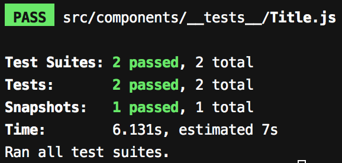

In case you haven't followed the [first](/react-native-tutorial/prettier-eslint-airbnb-styleguide) and [second](/react-native-tutorial/drawer-navigation-tabs-with-react-navigation) part of the series, you can clone the tutorial series and checkout the first part by running these commands:

```
git clone https://github.com/qaiser110/ReactNative-Bookstore-App-Tutorial.git bookstore-app
cd bookstore-app
git checkout 2-drawer-react-navigation
```

## Jest and Enzyme setup
 
Having unit tests for your code is really important, in order for you to have confidence in your code when you want to change something. It really pays off when you're adding more features, and you can make changes without the fear of breaking some existing functionality of your application as a result of the change. You know that your unit tests provide the safety net for your application from leaking out any defects into the production. 

We'll use jest as our testing framework along with Airbnb's JavaScript Testing utility [Enzyme](https://github.com/airbnb/enzyme). Enzyme has a flexible and intuitive intefcae that makes it very easy to assert, manipulate, and traverse React Components.

The create-react-native-app kit already includes all the jest related libraries and configurations. To work with Enzyme, we need to install `enzyme`, and some related dependencies. Since we're using React 16, we'll be adding `react-dom@16` and `enzyme-adapter-react-16`. 

```
npm install -D enzyme react-dom@16 enzyme-adapter-react-16 
```

We need to configure `enzyme-adapter-react-16`. We'll do this in jest setup. Create `jestSetup.js` file project's root, with the following code:

```js
import { configure } from 'enzyme'
import Adapter from 'enzyme-adapter-react-16'

configure({ adapter: new Adapter() })
```

Now, add this file to jest configuration in `package.json`:

```json
  "jest": {
    "preset": "jest-expo",
    "setupTestFrameworkScriptFile": "<rootDir>/jestSetup.js"
  },
```

## Enzyme and snapshot tests for our Title component

Now, we're all set to add enzyme tests. I prefer having tests co-located with my code. Let's create a simple test for our Title component by adding a test file next to  our Title component. In this test, we'll simply shallow render the Title component, create a snapshot, and verify the component styles. Create the file `src/components/__tests__/Title.js`, with the following content: 

```js
import React from 'react'
import { shallow } from 'enzyme'
import Title from '../Title'

it('renders correctly', () => {
  const wrapper = shallow(<Title text="Sample Text" />)
  expect(wrapper).toMatchSnapshot()

  expect(wrapper.prop('accessible')).toBe(true)
  expect(wrapper.prop('style')).toEqual({
    backgroundColor: '#434343',
    color: '#fff',
    fontSize: 20,
    marginTop: 20,
    padding: 20,
    textAlign: 'center',
  })
})
```

Let's run our our tests:

```
npm test
```

The tests should pass and generate a snapshot, giving the following output:



In case you're not familiar with Jest Snapshot testing, it is a great to test React components or n general, different kinds of outputs. Basically, the `toMatchSnapshot()` call renders your component and creates a snapshot in the `__snapshots__` directory (if the snapshot doesn't already exist). After that, each time you re-run your tests, jest will compare the output of the rendered component with that of the snapshot, and will fail if there is a mismatch. It will show the difference between the expected and the actual output. you can then review the differences and if this difference is valid due to some change that you've implemented, you camn re-run the tests with an `-u` flag, signaling jest to update the snapshot with the new updates.

Here's the <a href="https://github.com/qaiser110/ReactNative-Bookstore-App-Tutorial/commit/8280243d7c9cab6b69b2b2ed530756fe8a4bdcca" target="_blank">diff for our changes so far for Jest and Enzyme test</a>, including the generated snapshot.

## enzyme-to-json serializer

If you open up the snapshot file (`src/components/__tests__/__snapshots__/Title.js.snap`), you'll notice that the content is not very readable, and is obfuscated by the code from Enzyme wrappers, since we're using Enzyme to render our component. Fortunately, there is [enzyme-to-json](https://github.com/adriantoine/enzyme-to-json) library available that converts the Enzyme wrappers to a format compatible with Jest snapshot testing. 

Let's install enzyme-to-json:

```
npm install -D enzyme-to-json
```

And add it to jest configurations as the snapshot serializer in `pacakge.json`:
```json
  "jest": {
    ...
    "snapshotSerializers": ["enzyme-to-json/serializer"]
  },
```

Since we now expect the snapshot to be different from the previous snapshot, we'll pass the `-u` flag to update the snapshot:

```
npm test -- -u
```

If you open up the snapshot file again, you'll see that the snapshot for the rendered Title component is correct.

We'll dive more into Jest testing in the later sections.
