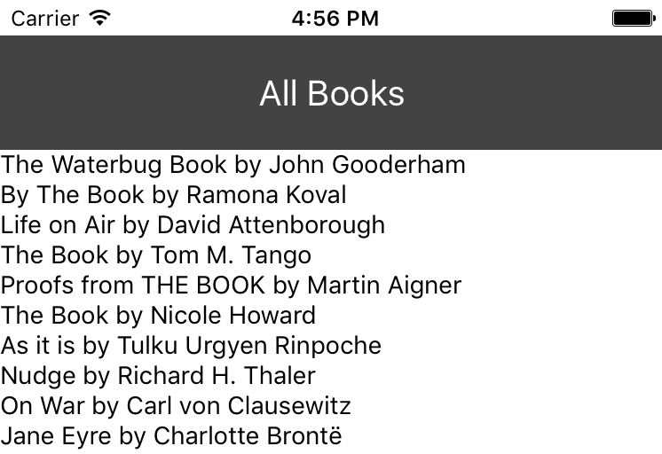
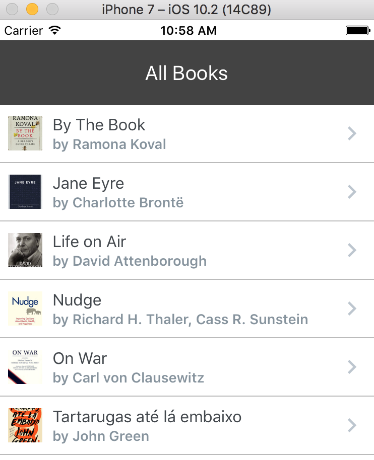

In case you're not following the [full series](/react-native-tutorial), you can clone the tutorial series and checkout the first part by running these commands:

```
git clone https://github.com/qaiser110/ReactNative-Bookstore-App-Tutorial.git bookstore-app
cd bookstore-app
git checkout 3-jest-enzyme-testing
```

## MobX or Redux for state management

While React is great for managing the view of your application, you generally need tools for store management of your application. I say generally because you may not need a state management library at all, it all depends on the type of application you are building. There are several state management libraries out there, most popular of them are Redux and MobX.  We'll be using Mobx store for our Bookstore application. 

While I love functional programming and working with pure functions which Redux is heavily influenced by, for the store management, I generally prefer MobX to Redux because I feel that it takes a lot more time to add new store data in Redux compared to MobX. You need to add a lot of boilerplate code in Redux. You have to write code for dispatching actions and transforming state yourself in Redux, while MobX does the job for you, and does it well. I find very easy to work with, whether it's initial setup, or adding more functionality. Redux also enforces you to implement things in a specific way, and while this would be a good thing in some applications, I find that the amount of time it takes might not be worth it for many application. MobX doesn't force you to implement you data flow in a specific way, and you have much more freedom. Again, that might be more problematic than a good thing if you don't setup your MobX stores correctly. I know this is a sensitive topic, and I don't want to start a debate here, so I'll leave this topic for another day, but if you want more perspective on this, there are [several](https://www.robinwieruch.de/redux-mobx-confusion/) [perspectives](https://medium.com/@adamrackis/a-redux-enthusiast-tries-mobx-af675f468c11) on this available on the internet. Redux and MobX are both great tools for store management.

We'll be gradually adding functionality to our store instead of adding all at once, just to show you how easy it is to add more features to MobX stores.

## MobX State Tree

We won't use Mobx directly, but a wrapper on MobX called [mobx-state-tree](https://github.com/mobxjs/mobx-state-tree). They've done a fine job of describing themselves, so I'll just quote them here:

> Simply put, mobx-state-tree tries to combine the best features of both immutability (transactionality, traceability and composition) and mutability (discoverability, co-location and encapsulation). - MST Github page

Let's install [mobx](https://github.com/mobxjs/mobx) along with [mobx-react](https://github.com/mobxjs/mobx-react) and [mobx-state-tree](https://github.com/mobxjs/mobx-state-tree)

```npm install --save mobx mobx-react mobx-state-tree```


We'll be using Google Books API to fetch the books for our app. If you want to follow along, you'll have to create a project in the Google Developers Console, enable Google Books API on it, and create an API Key in the project. Once you have the API Key, create a file `keys.json` in the project root, with the following content (replace `YOUR_GOOGLE_BOOKS_API_KEY` with your API key):

```json
{
  "GBOOKS_KEY": "YOUR_GOOGLE_BOOKS_API_KEY"
}
```

**NOTE**: If you don't want to go through this process of getting an API key, don't worry. We won't be using Google API directly, and will mock the data instead.

Google Books API endpoint `books/v1/volumes` returns an array of `items` where each item contains information on a specific book. Here's a cut down version of a book:

```json
{
  kind: "books#volume",
  id: "r_YQVeefU28C",
  etag: "HeC4avg1XlM",
  selfLink: "https://www.googleapis.com/books/v1/volumes/r_YQVeefU28C",
  volumeInfo: {
    title: "Breaking Everyday Addictions",
    subtitle: "Finding Freedom from the Things That Trip Us Up",
    authors: [
      "David Hawkins"
    ],
    publisher: "Harvest House Publishers",
    publishedDate: "2008-07-01",
    description: "Addiction is a rapidly growing problem among Christians and non-Christians alike. Even socially acceptable behaviors, ...",
    pageCount: 256,
    printType: "BOOK",
    categories: [
      "Addicts"
    ],
    imageLinks: {
      smallThumbnail: "http://books.google.com/books/content?id=r_YQVeefU28C",
      thumbnail: "http://books.google.com/books/content?id=r_YQVeefU28C&printsec=frontcover"
    },
    language: "en",
    previewLink: "http://books.google.com.au/books?id=r_YQVeefU28C&printsec=frontcover",
    infoLink: "https://play.google.com/store/books/details?id=r_YQVeefU28C&source=gbs_api",
    canonicalVolumeLink: "https://market.android.com/details?id=book-r_YQVeefU28C"
  }
}
```

We won't be using all the field return in the API response. So we'll create our MST model for only the data we need in our ReactNative app. Let's define our Book model in MST. Create a new directory structure `stores/book` inside `src`, and create a new file `index.js` inside it:

```js
// src/stores/book/index.js
import { types as t } from 'mobx-state-tree'

const Book = t.model('Book', {
  id: t.identifier(),
  title: t.string,
  pageCount: t.number,
  authors: t.array(t.string),
  image: t.string,
  genre: t.maybe(t.string),
  inStock: t.optional(t.boolean, true),
})
```

In the above MST node definition, our `Book` model type is defining the shape of our node -- of type `Book` -- in the in the MobX State Tree. The `types.model` type in MST is used to describe the shape of an object. Giving the model a name isn't required, but is recommended for debugging purpose. The second argument, the properties argument, is a key-value pair, where the key is the name of a property, and the value is its type. In our model, `id` is the **identifier**, `title` is of type **string**, `pageCount` is of type **number**, `authors` is an **array of strings**, `genre` is of type **string**, `inStock` of type **boolean**, and `image` of type **string**. All the data is required by default to create a valid node in the tree, so if we tried to insert a node without a title, MST won't allow it, and throw an error. 

The `genre` will be mapped to the `categories` field (first index value of the categories array) of the Google Books API data. It may or may not be there in the response. Therefore, we've made it of type `maybe`. If the data for **genre** is not there in the response, `genre` will be set to `null` in MST, but if it's there, it must be of type **string** for it to be valid. 

Since `inStock` is our own field, and is not returned in the response from the Google Books API, we've made it optional and gave it a default value of true. We could have simply assigned it the value `true`, since for primitive types, MST can infer type from the default value. So `inStock: true` is the same as `inStock: t.optional(t.boolean, true)`. 

[Creating models](https://github.com/mobxjs/mobx-state-tree#creating-models) section of the *mobx-state-tree* documentation goes into detail about creating models in MST. 

```js
// src/stores/book/index.js
const BookStore = t
  .model('BookStore', {
    books: t.array(Book),
  })
  .actions(self => {
    function updateBooks(books) {
      books.forEach(book => {
        self.books.push({
          id: book.id,
          title: book.volumeInfo.title,
          authors: book.volumeInfo.authors,
          publisher: book.volumeInfo.publisher,
          image: book.volumeInfo.imageLinks.smallThumbnail,
        })
      })
    }

    const loadBooks = process(function* loadBooks() {
      try {
        const books = yield api.fetchBooks()
        updateBooks(books)
      } catch (err) {
        console.error('Failed to load books ', err)
      }
    })

    return {
      loadBooks,
    }
  })
```

MST trees are protected by default. This means that only the MST actions can change the state of the tree. We've defined two actions, `updateBooks` is a function that is only called by the `loadBooks` function, so we're not exposing it to the outside world. `loadBooks` on the other hand, is exposed (we're returning it), and can be called from outside the `BookStore`. 

Asynchronous actions in MST are written using generators and always return a promise. In our case, `loadBooks` needs to be Asynchronous since we're making an Ajax call to the Google Books API.

We'll maintain a single instance of the `BookStore`. If the store already exists, we'll return the existing store, and if not, we'll create one and return that new store:

```js
// src/stores/book/index.js
let store = null

export default () => {
  if (store) return store

  store = BookStore.create({ books: {} })
  return store
}
```

## Using the MST store in our view

Let's start with the All Books view. To do that, we'll create a new file containing our `BookListView` component:

```js
import React, { Component } from 'react'
import { observer } from 'mobx-react'
import BookStore from '../../../stores/book'
import BookList from './BookList'

@observer
class BookListView extends Component {
  async componentWillMount() {
    this.store = BookStore()
    await this.store.loadBooks()
  }

  render() {
    return <BookList books={this.store.books} />
  }
}
```

As you can see, we're initializing the `BookStore` in `componentWillMount`, and then calling `loadBooks()` to fetch the books from Google Books API asynchronously. The `BookList` component iterates over the `books` array inside the __BookStore__, and reenders the `Book` component for each book. Now, we just need to add this `BookListView` component to `AllBooksTab`.

If you start the app now, you'll see that the books are loading as expected.

Note that I'm using Pascal case naming convention for a file that return a single React component as the default export. For everything else, I use Kebab case. You may decide to choose a different naming convention for your project.

If you run `npm start` now, you should see a list of books fetched by the Google API.



Here's the <a href="https://github.com/qaiser110/ReactNative-Bookstore-App-Tutorial/commit/ad23749ed9ed8ba157fade215ce20df0c2312ede" target="_blank">diff for our changes so far</a>.


## Adding tests for our MST BookStore

Let's add some unit tests for our BookStore. However, our store is talking our api which calls the Google API. Although we can add integration tests for our store, but to add unit tests, we need to mock the API somehow. A simple way to mock the API is to use [Jest Manual Mocks](https://facebook.github.io/jest/docs/en/manual-mocks.html) by creating `__mocks__` directory next to our existing `api.js` file, and inside it, create another `api.js`, the mocked version of our API fetch calls. Then, we just call `jest.mock('../api')` in our test to use this mocked version.

### Dependency Injection in MobX State Tree

We won't be using Jest Manual Mocks. I'd like to show you another feature in MST, and demonstrate how easy it is to mock our API using MST. We'll use Dependency injection in MobX State Tree to provide an easy way to mock the API calls, making our store easy to test. Mote that our MST store can also be tested without Dependency Injection using Jest Mocks, but we're doing it this way just for demonstration.

It is possible to inject environment specific data to a state tree by passing an object as the second argument to the `BookStore.create()` call. This object will be accessible by any model in the tree by calling `getEnv()`. We'll be injecting a mock API in our BookStore, so let's first add the optional `api` parameter to the default export, and set it to the actual `bookApi` by default.

```js
// src/stores/book/index.js
let store = null

export default () => {
  if (store) return store

  store = BookStore.create({ books: {} })
  return store
}
```

Now, add an [MST View](https://github.com/mobxjs/mobx-state-tree#views) for the injected API, by grabbing it using `getEnv()`, and then use it in the `loadBooks` function as `self.api.fetchBooks()`:

```js
// src/stores/book/index.js
// ...
.views(self => ({
    get api() {
      return getEnv(self).api
    },
}))
```

Let's now create a mock API with the same fetch function as the real API fetch function:
```js
// src/stores/book/mock-api/api.js
const books = require('./books')

const delayedPromise = (data, delaySecs = 2) =>
  new Promise(resolve => setTimeout(() => resolve(data), delaySecs * 1000))

const fetchBooks = () => delayedPromise(books)

export default {
  fetchBooks,
}
```

I've added a delay in response so that teh response is not sent immediately. I've also create a json file with the some data similar to that of the response sent by Google Books API `src/stores/book/mock-api/books.json`.

Now, we're ready to inject the mock API in our tests. Create a new test file for our store with the following content:

```js
// src/stores/book/__tests__/index.js
import { BookStore } from '../index'
import api from '../mock-api/api'

it('bookstore fetches data', async () => {
  const store = BookStore.create({ books: [] }, { api })
  await store.loadBooks()
  expect(store.books.length).toBe(10)
})
```

Run the store test:

```
npm test src/stores/book/__tests__/index.js
```

You should see the test pass.

## Adding books filter via TDD

I believe in a hybrid approach to Test Driven Development. In my experience, it works best if you add some basic functionality first when starting a project, or when you're adding a new module or a major functionality from scratch. Once the basic setup and structure is implemented, then TDD works really well. But I do believe that TDD is the best way to approach a problem space in code. It not only forces you to have better code quality and design, but also ensures that you have atomic unit tests, that your unit tests are more focused on testing specific functionality, rather than stuffing too many assertions in a test. 
 
Before we start adding our test and make changes to our store, I'll change the delay in our mock API to 300 millisecs to ensure taht our tests run faster. 

```js
const fetchBooks = () => delayedPromise(books, 0.3)
```

We want a `filter` field in our `BookStore` model, and a `setGenre()` action in our store for changing the value of the this `filter`. 

```js
it(`filter is set when setGenre() is called with a valid filter value`, async () => {
  store.setGenre('Nonfiction')
  expect(store.filter).toBe('Nonfiction')
})
```

To run tests only for our BookStore, and to keep the tests running, watching for changes and re-run the test on code change, we'll use the watch command and use file path pattern matching:

```
npm test stores/book -- --watch
```

The above test should fail, because we haven't written the code yet to make the test pass. The way that TDD works is, you write an atomic test to test a smallest unit of a business requirement, and then add code to make just that test pass. You go through the same process iteratively, until you've added all the business requirements. To make our test pass, we'll have to add a `filter` field of ENUM type in our `BookStore` model:

```js
.model('BookStore', {
    books: t.array(Book),
    filter: t.optional(
        t.enumeration('FilterEnum', ['All', 'Fiction', 'Nonfiction']),
        'All'
    ),
})
```

And add an MST action which will allow us to change the filter value:

```js
const setGenre = genre => {
  self.filter = genre
}

return {
  //...
  setGenre,
}
```

And with these two changes, we should be in the green. Let's also add a negative test for an invalid filter value:

```js
it(`filter is NOT set when setGenre() is called with an invalid filter value`, async () => {
  expect(() => store.setGenre('Adventure')).toThrow()
})
```

And this test should also pass. This is because we're using an ENUM type in our MST store, and the only allowed values are `All`, `Fiction`, and `Nonfiction`.

Here's the <a href="https://github.com/qaiser110/ReactNative-Bookstore-App-Tutorial/commit/925920c430a3449b9e1010b11d1d662c8e88ac6a" target="_blank">diff of our recent changes</a>.

### Sorting and filtering the books

The first index value in `categories` field of the mock data is categorising the book as **Fiction** or **Nonfiction**. We will use it to filter the books for our **Fiction** and **Nonfiction** tabs respectively.

We also want our books to be always sorted by title. Let's add a test for this: 

Let's first add a test for our sorting the books: 

```js
it(`Books are sorted by title`, async () => {
  const books = store.sortedBooks
  expect(books[0].title).toBe('By The Book')
  expect(books[1].title).toBe('Jane Eyre')
})
```

To make our test pass, we'll add a view named `sortedBooks` in our `BookStore` model:

```js
get sortedBooks() {
  return self.books.sort(sortFn)
},
```

And with this change, we should be in the green again.

### About MST Views

We just added the `sortedBooks` view in our `BookStore` model. To understand how MST Views work, we'll have to understand MobX. The key concept behin MobX is: anything that can be derived from the application state, should be derived, automatically. In [this egghead.io video](https://egghead.io/lessons/javascript-derive-computed-values-and-manage-side-effects-with-mobx-reactions), the MobX creator [Michel Weststrate](https://twitter.com/mweststrate) has explained the key concepts behind MobX. I'll quote a key concept here:

> MobX is built around four core concepts. Actions, observable state, computed values, and reactions... Find the smallest amount of state you need, and derive all the other things... 

The computed values should be pure functions in terms of depending only on observable values or other computed values, they should have no side effects. Computed properties are lazily evaluated, their value is evaluated only when their value is requested. The computed values are also cached in MobX, and this cached value is returned when this computed property is accessed. When there's a change in any of the observable values being used in it, the Computed property is recomputed.

[MST Views](https://github.com/mobxjs/mobx-state-tree#views) are derived from the current observable state. Views can be with or without arguments. Views without arguments are basically [Computed values](https://mobx.js.org/refguide/computed-decorator.html) from MobX, defined using getter functions. When an observable value is changed from an MST action, the affected view gets recomputed, triggering a change (reaction) in the `@observer` components.  


## Adding tests for genre filter

We know that there are 7 Nonfiction books in the mock data. Let's now add a test for filtering by `genre`:

```js
it(`Books are sorted by title`, async () => {
  store.setGenre('Nonfiction')
  const books = store.sortedBooks
  expect(books.length).toBe(7)
})
```

To make filtering by genre work, we'll add a `genre` field of string type in our `Book` model, and map it to the `volumeInfo.categories[0]` received from the API response. We'll also change the `sortedBooks` view getter in our `BookStore` model to filter the books before sorting them:

```js
get sortedBooks() {
  return self.filter === 'All'
    ? self.books.sort(sortFn)
    : self.books.filter(bk => bk.genre === self.filter).sort(sortFn)
},
```

And again, all tests are passing.

Here's the <a href="https://github.com/qaiser110/ReactNative-Bookstore-App-Tutorial/commit/620be74af6c5bbf119478405388c8bf978d85586" target="_blank">diff of our recent changes</a>.

## Update the UI on tab change

**NOTE**: From here on, we'll use the mock data for our actual API calls instead of making Ajax requests to Google Books API. To do this, I've changed the `bookApi` in the `stores/book/index.js` to point to the mock API (`./mock-api/api.js`).

the only different in the three tabs, namely "All", "Fiction", "NonFiction", is the data that they'll display. 

Note that the display for all the three tabs ("All", "Fiction" and "NonFiction" tabs) is similar. The layout and format of the items would be the same, and the only difference is the data that they'll display. And since Mobx allows us to keep our data completely separate from the view, we can get rid of the three separate views, and use the same component for all the three tabs. This means that we don't need the three separate tabs anymore. So we'll delete the `book-type-tabs.js` file, and use the `BookListView` component directly in our **TabNavigator** for all three tabs. We'll use the `tabBarOnPress` callback to trigger the call to `setGenre()` in our `BookStore`. The `routeName`, available on the navigation state object, is passed in to `setGenre()` to update the filter when user presses a tab. Here's the updated TabNavigator:

```js
// src/views/book/index.js

export default observer(
  createBottomTabNavigator(
    {
      All: BookListView,
      Fiction: BookListView,
      Nonfiction: BookListView,
    },
    {
      navigationOptions: ({ navigation }) => ({
        tabBarOnPress: () => {
          const { routeName } = navigation.state
          const store = BkStore()
          store.setGenre(routeName)
        },
      }),
    }
  )
)
```

Note that we're wrapping `createBottomTabNavigator` in MobX `observer`. This is what converts a React component class or stand-alone render function into a reactive component. In our case, we want the filter in our BookStore to change when `tabBarOnPress` is called. 

We'll also change the view to get sortedBooks instead of books.

```js
// src/views/book/components/BookListView.js

class BookListView extends Component {
  async componentWillMount() {
    this.store = BkStore()
    await this.store.loadBooks()
  }

  render() {
    const { routeName } = this.props.navigation.state
    return (
      <View>
        <Title text={`${routeName} Books`} />
        <BookList books={this.store.sortedBooks} />
      </View>
    )
  }
}
```

## Styling our Book List

Our Book list  just lists the name and authors of each book, but we haven't added any styling to it yet. Let's do that using the `ListItem` component from `react-native-elements`. This is simple change:

```js
// src/views/book/components/Book.js

import { ListItem } from 'react-native-elements'

export default observer(({ book }) => (
  <ListItem
    avatar={{ uri: book.image }}
    title={book.title}
    subtitle={`by ${book.authors.join(', ')}`}
  />
))
```

And here's what our view looks like now:



Here's the <a href="https://github.com/qaiser110/ReactNative-Bookstore-App-Tutorial/commit/b3ec126149833056e4e417218eca2e674b3b272d" target="_blank">diff of our recent changes</a>.

## Add Book Detail

We'll add a field `selectedBook` to our `BookStore` which will point to the selected Book model. 

```js
  selectedBook: t.maybe(t.reference(Book))
```

We're using a MST reference for our `selectedBook` observable. [References in MST stores](https://github.com/mobxjs/mobx-state-tree#references-and-identifiers) make it easy to make references to data and interact with it, while keeping the data normalized in the background.

We'll also add an action to change this reference:

```js
const selectBook = book => {
  self.selectedBook = book
}
```

When a user taps on a book in the `BookListView`, we want to navigate the user to the `BookDetail` screen. So we'll create a `showBookDetail` function for this, and pass it as props to the child components: 

```js
// src/views/book/components/BookListView.js
const showBookDetail = book => {
  this.store.selectBook(book)
  this.props.navigation.navigate('BookDetail')
}
```

In the `Book` component, we call the above `showBookDetail` function on `onPress` event on the Book `ListItem`:

```js
// src/views/book/components/Book.js

onPress={() => showBookDetail(book)}
```

Let's now create the `BookDetailView` that will be displayed on pressing a book:

```js
// src/views/book/components/BookDetailView.js

export default observer(() => {
  const store = BkStore()
  const book = store.selectedBook

  return (
    <View>
      <View>
        <Card title={book.title}>
          <View>
            <Image
              resizeMode="cover"
              style={{ width: '60%', height: 300 }}
              source={{ uri: book.image }}
            />
            <Text>Title: {book.title}</Text>
            <Text>Genre: {book.genre}</Text>
            <Text>No of pages: {book.pageCount}</Text>
            <Text>Authors: {book.authors.join(', ')}</Text>
            <Text>Published by: {book.publisher}</Text>
          </View>
        </Card>
      </View>
    </View>
  )
})
```

Previously, we only had tabs, but now, we want to show the detail when the user taps on a book. So we'll export a `createStackNavigator` instead of exporting `createBottomTabNavigator` directly. The `createStackNavigator` will have two screens on the stack, the `BookList` and the `BookDetail` screen:

```js
// src/views/book/index.js
export default createStackNavigator({
  BookList: BookListTabs,
  BookDetail: BookDetailView,
})
```

Note that we're having the List view and the Detail view inside the `createStackNavigator`. This is because we want to share the the same `BookDetailView` only with different content (filtered books). If, on the other hand, we wanted a different detail view showing up from different tabs, then we would have created two separate StackNavigators, and included them inside a TabNavigator, something like this:

```js
const TabStackA = createStackNavigator({
  Main: MainScreen,
  Detail: DetailScreen,
});

const TabStackB = createStackNavigator({
  Main: MainScreen,
  Detail: DetailScreen,
});

export default createBottomTabNavigator(
  {
    TabA: TabStackA,
    TabB: TabStackB,
  }
)
``` 

Here's the <a href="https://github.com/qaiser110/ReactNative-Bookstore-App-Tutorial/commit/0a40ffd056eb160e07e24a0dd83ada953776c703" target="_blank">diff of our recent changes</a>.

## Styling the tabs

Our tab labels look a bit small, and are hitting the bottom of the screen. Let's fix that by increasing the `fontSize` and adding some `padding`:

```js
// src/views/book/index.js

const BookListTabs = observer(
  createBottomTabNavigator(
    {
      All: BookListView,
      Fiction: BookListView,
      Nonfiction: BookListView,
    },
    {
      navigationOptions: ({ navigation }) => ({
        // ...
      }),
      tabBarOptions: {
        labelStyle: {
          fontSize: 16,
          padding: 10,
        },
      },
    }
  )
)
```

Let's run our app, tap on a book, and the Book detail screen should be displayed with the book details.

And this concludes our series on creating ReactNative application with MobX store. Please feel free to give feedback on the tutorial, and anything that I might have missed or you would like me to add.
