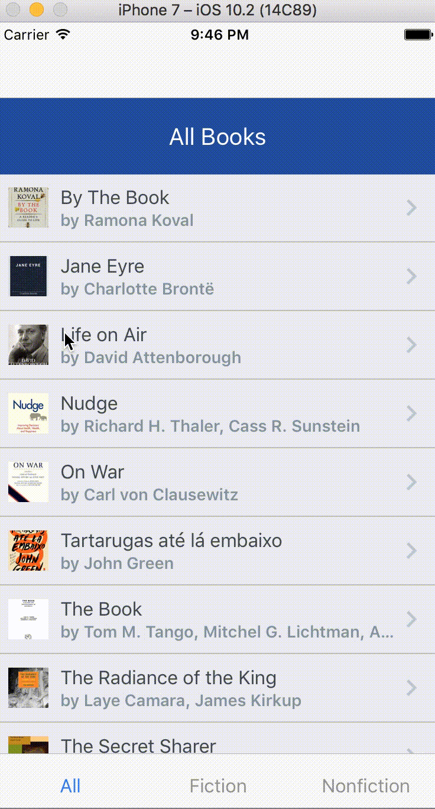

##Introduction

In this series, we'll build a mobile application in ReactNative, and also explore some of the development practices including directory structure, state management (in Mobx) code styling and linting tools (prettier, eslint, and arirbnb style guide), and an important, but often ignored part - unit-testing your application (via jest and enzyme).

## About our App

The application we're building is for a Book Store. It will mainly consist of two simple views, Books View and Authors View. The app will contain a navigation drawer with two menu options, allowing the user to switch between the two views. The first option would be for navigating to the Books View, and the other option would be for the Authors View. The Books View will contain the list of books, while the Authors View will containing the list of authors. The Book View will further contain tab navigation allowing the user to switch between Fiction and Non-Fiction books.

We'll be installing everything on a Mac OS. Most of the commands will be the same when you have node installed, but if you face any issues, let me know, or just google it.

### Topics Covered

There are four parts in this series. We'll cover different topics and libraries necessary to create and test a full blown React Native application: 

1. In [part I](/react-native-tutorial/prettier-eslint-airbnb-styleguide), we'll setup prettier, eslint, and arirbnb style guide for our project.
2. In [part II](/react-native-tutorial/drawer-navigation-tabs-with-react-navigation), we'll add Drawer and Tabs Navigation using react-navigation.
3. In [part III](/react-native-tutorial/testing-with-jest-enzyme), we'll test our React components with Jest and Enzyme
4. In [part IV](/react-native-tutorial/mobx-state-tree), we'll work on the state management of our app using MobX (mobx-state-tree). It will also involve some UI changes and more navigation. We'll sort and filter the books by genre, and allow the user to see the Book detail screen when the user taps on a book.

Here's a demo of the Bookstore app we're going to build:



### What we won't Covered

There are a few things we won't cover in this series, which you may want to consider in your project:

1. Tools for adding static type system in JavaScript, like [flow](https://flow.org/) and [TypeScript](https://www.typescriptlang.org/).
2. Although we will add some styles to our app, we won't go into details and the different options available for adding styles in a ReactNative application. The [styled-components](https://github.com/styled-components/styled-components) library is one of the most popular ones for both React and ReactNative applications.
3. We won't build a separate backend for our application. We will go through integration with the Google Books API, but we'll use mock data for the most part.

Before we continue to the first part of thsi series, we'll initialize our ReactNative app using [CRNA](https://github.com/react-community/create-react-native-app) CLI. So let's get started!

## Create React Native application using create-react-native-app CLI (CRNA)

[Create React Native App](https://github.com/react-community/create-react-native-app) is a tool created in collaboration between [Facebook](https://code.facebook.com/) and [Expo](https://expo.io/) team that makes it a breeze to get started with a React Native project.

Assuming that you have [Node](https://nodejs.org/en/download/) already installed, , we need to install `create-react-native-app` globally, so that we can initialize a new React Native project for our Book Store.

```sh
npm install -g create-react-native-app
```

Now, we can use the create-react-native-app CLI to create our new React Native project. Let's name it `bookstore-app`:

```sh
create-react-native-app bookstore-app
```

Once CRNA is done bootstrapping our React Native application, it will show the helpful commands. Let's change directory to the newly created CRNA app, and start it.

```sh
cd bookstore-app
npm start
```

This will start the packager, giving the option to launch the iOS or Android simulator, or open the app on a real device. 

If you face any issues, please refer to either the [React Native's getting started guide](https://facebook.github.io/react-native/docs/getting-started.html) or [Create React Native app (CRNA) guide](https://github.com/react-community/create-react-native-app/blob/master/react-native-scripts/template/README.md)

### Opening the CRNA app on a real device via Expo

When the app is started via `npm start`, a QR code will be displayed in your terminal. The easiest way to look at our bootstrapped app is using the Expo app. To do that:
1. Install the [Expo](https://expo.io/) client app on your iOS or Android device.
2. Make sure that you are connect to the same wireless network as your computer.
3. Using the Expo app, scan the QR code from your terminal to open your project.

### Opening the CRNA app in a simulator

To run the app on iOS Simulator, you'll need to install Xcode. To run the app on an Android Virtual Device, you need to setup the Android development environment. Look at the react-native getting started guide for for both the setups.  
